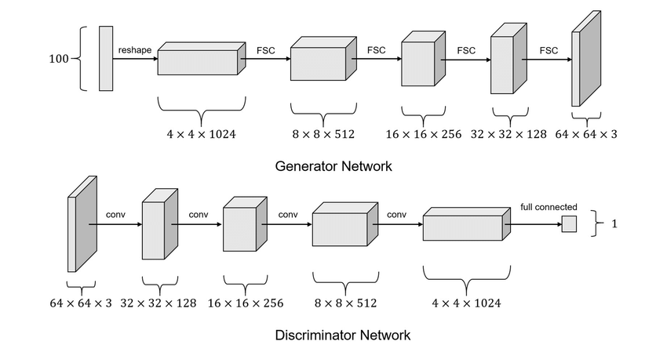
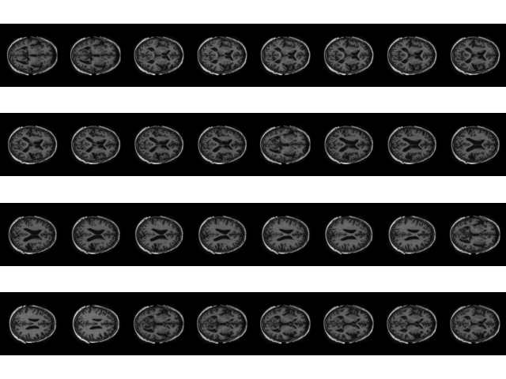
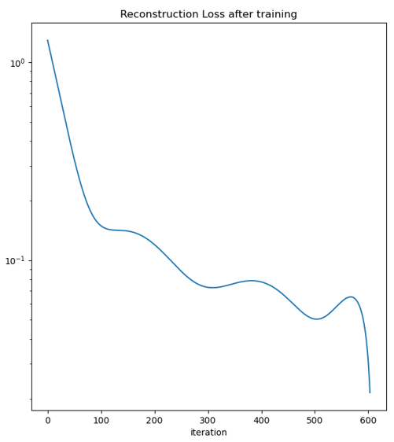
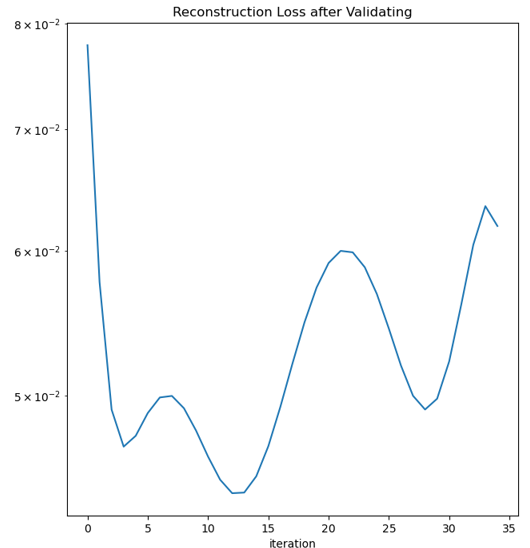
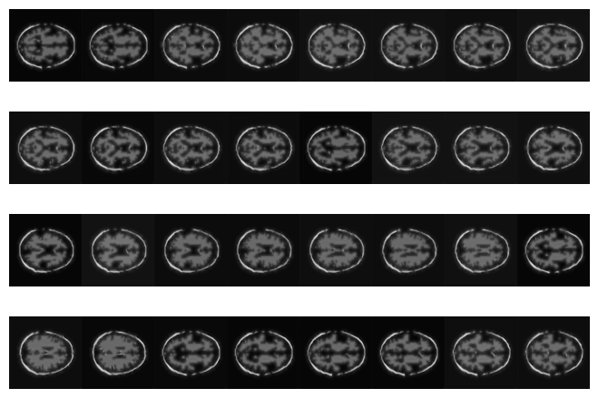
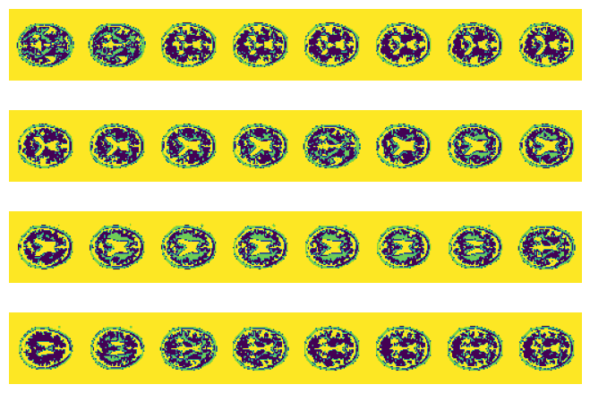
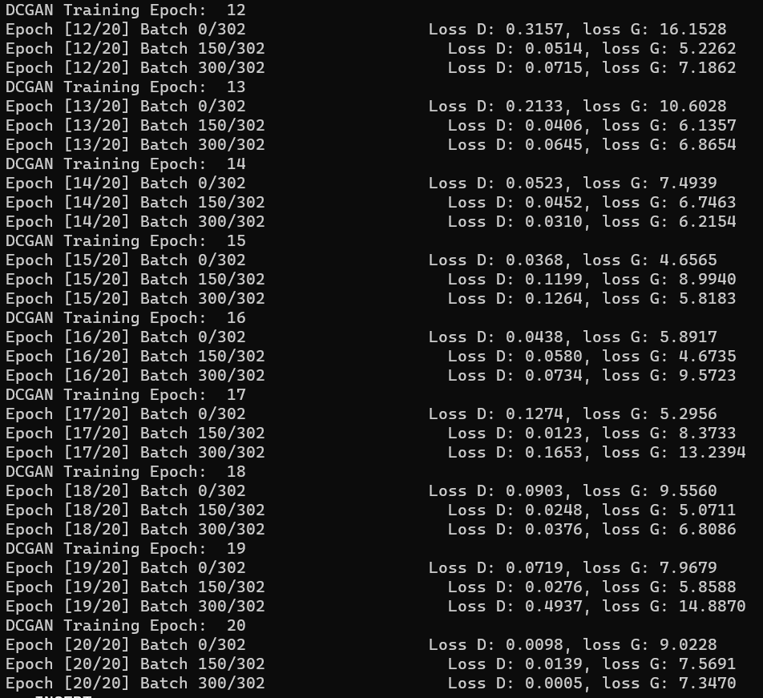
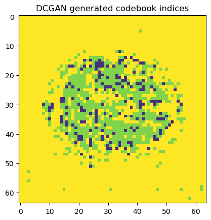
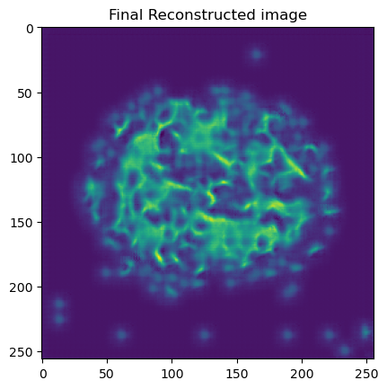

# **Implementing the VQVAE model on the OASIS-1 brain dataset**

## Background on VQVAE

### What is it?
VQ-VAE stands for Vector Quantized Variational Autoencoder. It is one type of variational autoencoder amongst others and uses vector quantisation to obtain discrete latent representation [2]. The overall model architecture can be seen in the image below.

### Why it is effective?
Generally for VAE's, "the latent space is continuous and is sampled from a Gaussian distribution." [3] Whereby VQVAE's "operate on a discrete latent space, making the optimization problem simpler."[3] It does this by keeping a discrete codebook which discretizes the distance between continuous embeddings and encoded outputs. [3]

## Background on the OASIS-1 brain dataset
The OASIS-1 dataset consists of Cross-sectional MRI Data in young, middle aged, nondemented and demented older adults. This dataset arose from 416 subjects aged from 18 - 96 with over 434 MR sessions [1].

## Background on DCGAN

### What is it?
The Deep Convolutional Generative Adversarial Network (DCGAN) is a type of CNN that serves as a way to generate new images after training generator and discriminator networks. [4] The overall model architecture of a DCGAN can be seen in the image below.

### Why is it effective?
A DCGAN was chosen over a regular GAN for this task due to it's improved performance for image generation as a result of its deep convolutional architecture. A DCGAN implements convolutional and convolutional-transpose layers in its generator and discriminator networks respectively. [4] Furthermore, DCGAN's have also been found to be more stable during training and have higher image quality when compared to regular GAN's.

## Preparing Datatsets
All dataset classes are created in the *dataset.py* file. There are two classes implemented for downloading the OASIS dataset from a specified directory, performing the necessary transforms and creates functions to be called when requiring either the train, validation or test dataloaders. This file also includes a class that handles the dataloader required for the DCGAN. This class takes in a trained VQVAE model, and returns the encodings of original OASIS training images. 

The following image shows an example of the original OASIS images that was used as training images for the VQVAE model. 

## Creating Models
Both the VQVAE and DCGAN models are implemented as classes within the *modules.py* file. For the VQVAE model, there are classes that create residual blocks(from residual layers), an encoder, a decoder, a vector quantizer and a class that combines all necessary components to form the VQVAE model. For the DCGAN, there is a Generator class and Discriminator class, as well as a function for initialising weights for these networks. 

## Training Procedure

### Training VQVAE
There are three main files involved for the training of the VQVAE and DCGAN. The *train.py* file calls classes from the *train_VQVAE.py* and *train_DCGAN.py* files for training each individual model. The *train_VQVAE.py* file includes a class with a function for training the VQVAE model, plotting the training reconstruction losses and saving the model to the current working directory. It also includes a function for validation testing after training the model and saving reconstructed images on unseen data. The model is trained on only 2 epochs as it was found to output sufficient reconstructions. The VQVAE model implemented a batch size of 32 and a learning rate of 0.001. The mean reconstruction loss was printed after each epoch and is seen below. 

 The training and validation reconstruction loss plots can be seen below. From the reconstruction error plot, it is clear that the loss steadily decreases over the two epochs.

Within the test function of the *train_VQVAE.py* file, the trained model is used to reconstruct test images taken from the test dataloader. These reconstructed images can be seen below. While it is clear there are some distortions present in the reconstructed test images, the VQVAE model does a sufficient job at reconstructing these images via its encoding, quantizing and decoding process.

### Training DCGAN
Following the training of the VQVAE model, the DCGAN was trained on the encoding indices of the trained OASIS images. The *train_DCGAN.py* file implements a class that creates a Generator and Discriminator model, initialises weights and contains a training function for these networks on the provided training data. The dataloader that was used as the input for training the DCGAN can be seen below.

The DCGAN utilised a batch size of 32, a learning rate of 0.001 and was trained for 50 epochs. The reconstruction loss during each epoch was printed and the last few can be seen below.

The loss plot of the Discriminator and Generator during training was also plotted. The biggest observation that was made in this plot is that the Generator continues to diverge as it trains for longer.

## Results
To run the entire training process and image generation part, the *predict.py* file should be called. This file calls the funciton from the *train.py* file that handles all the training for both models. This file also includes additional functions created in *modules.py* for saving the output from the DCGAN, saving the visualised codebook indices created from this generation and finally reconstructing the image after decoding the codebook indice image. 

A single image was visualised and saved to represent what the DCGAN Generator network outputs after passing through fixed noise. 

This generated image was then passed through a function for visualising the codebook indices.

The purpose of visualising the DCGAN generated codebook indice can be to visually see similarities with a codebook indice created purely from the trained VQVAE model. A VQVAE formed codebook indice can be seen below for comparison.

The final reconstruction for the DCGAN codebook indice can be seen below. It is clear from this image that there were flaws in either the model architecture, or decoding process as most of the details are lost during reconstructions. 

These poor results are also supported by the extremely low structural similarity index measure (SSIM). The SSIM between images should indicate the similarity based on various factors and it was aimed to be over 0.6 for this project. However due to errors that may have arisen at different stages of either the model architecture or reconstruction process, the final SSIM when taken for the test dataset only came to 0.05, as seen below.

## Future work and improvements

There is much work that could be done to make improvements to this project. Firstly, it should be noted that the VQVAE model performance was quite sufficient as multiple plots were made to check that reconstructions were appropriate, that the codebook indice images were formed correctly and that the DCGAN was taking in the appropriate type of data. The main area of work that should be improved upon is the generation of new images in the DCGAN section of the project. This part caused the most issues as prior to attaining these results, multiple hyperparameters were required to be tuned to produce a recognisable output. Some things that could be changed in future work includes the learning rate, batch size, number of epochs to train, the overall model architecture and potentially reconstruction functions for the DCGAN outputs. The DCGAN should be improved such that the loss plots of both networks begin to converge, rather than the generator network continue to diverge. 

## Dependencies
- matplotlib == 3.7.1
- numpy == 1.25.0
- Pillow == 9.4.0
- scikit-image == 0.22.0
- scipy == 1.9.3
- torch == 2.0.1
- torchvision == 0.15.2

# References
[1] www.oasis-brains.org. (n.d.). OASIS Brains - Open Access Series of Imaging Studies. [online] Available at: https://www.oasis-brains.org/.

[2] A. v. d. Oord, O. Vinyals, and K. Kavukcuoglu, “Neural Discrete Representation Learning,”
arXiv:1711.00937 [cs], May 2018, arXiv: 1711.00937. [Online]. Available: http://arxiv.org/abs/1711.00937

[3] Team, K. (2021). Keras documentation: Vector-Quantized Variational Autoencoders. [online] Keras.io. Available at: https://keras.io/examples/generative/vq_vae/#:~:text=In%20standard%20VAEs%2C%20the%20latent [Accessed 18 Sep. 2023].

[4] Radford, A., Metz, L. and Chintala, S. (n.d.). UNSUPERVISED REPRESENTATION LEARNING WITH DEEP CONVOLUTIONAL GENERATIVE ADVERSARIAL NETWORKS. [online] Available at: https://arxiv.org/pdf/1511.06434v2.pdf.